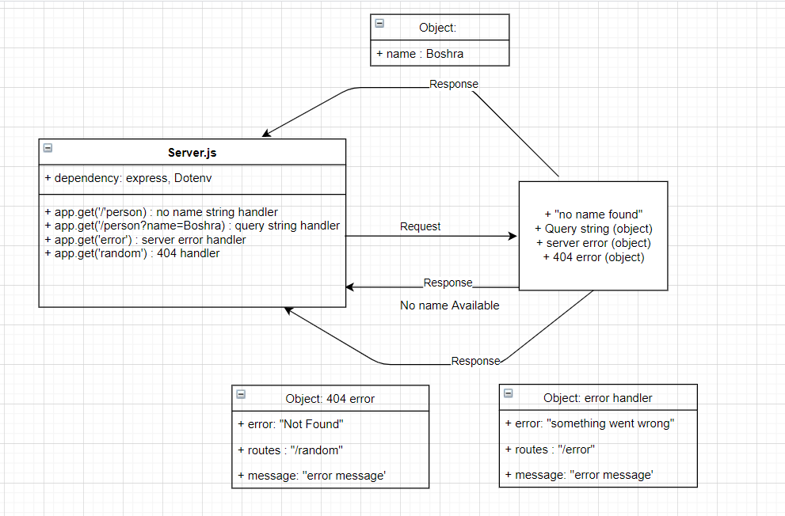

# Class 02- Lab02
# Basic Express Server
## Deployment Test
### Author: Boshra Jaber
* [tests report](https://github.com/BoshraJaber/basic-express-server/actions)
* [Heroku application for main branch](https://boshra-server-deploy-prod.herokuapp.com/)

## Setup
- `.env` requirements:
 * PORT - 3000
- Install Required Packages:
  * `npm i express dotenv`
  * `npm i -d jest supertest eslint`
  * `npm i -g nodemon`
- Running the app
 * `npm start`
 1. Endpoint: `/person/?name=Boshra`
   * Returns Object:
  ```
  {
   "name" : "Boshra"
  }
  ```
 2. Endpoint: `/person`
   * Returns Object:
  ```
  {
    "status": 500,
    "route": "/person"
    }
  ``` 
 3. Endpoint: `/error`
   * Returns Object:
  ```
  {
   "error": "Something went wrong!",
   "route": "/error",
   "message": "Error with the server"
   }
  ```
 4. Endpoint: `/random`
   * Returns Object:
  ```
  {
   "error": 404,
   "route": "/",
   "message": "Not Found"
   }
  ```
- In package.json file add:
  ```
  "scripts": {
    "start": "node index.js",
    "dev": "nodemon",
    "test": "jest --coverage --verbose ",
    "lint": "eslint '**/*.js'"
  }
  ```

## Tests
Unit Tests: `npm run test`
Lint Tests: `npm run lint`

## UML:
Here is a UML of my code: 
